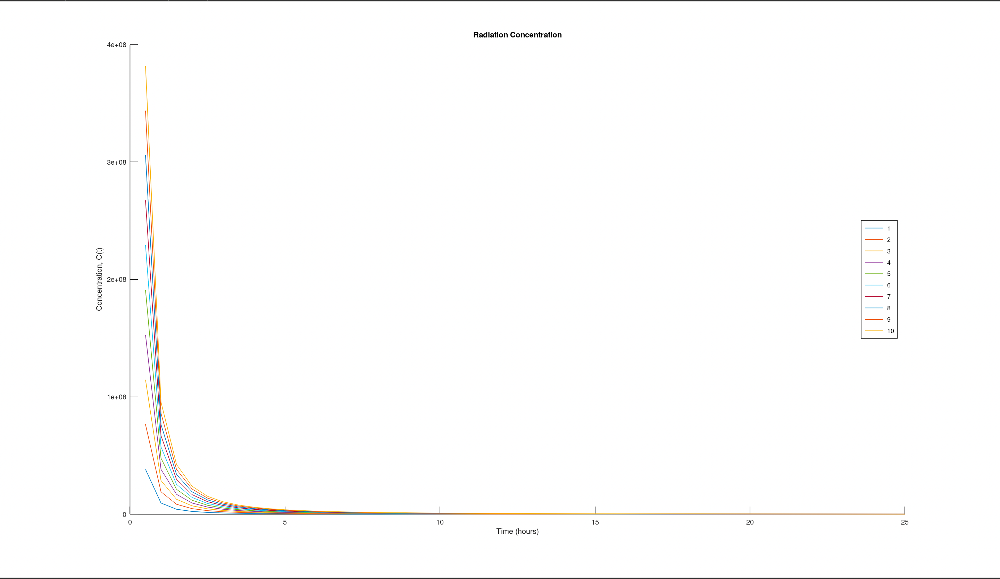

## Commands
```matlab
t = 0:0.5:25;
title ('Radiation Concentration');
xlabel('Time (hours)'); ylabel('Concentration, C(t)');
hold on;
for a = 1:1:10
    particles = a * 1.2 * 10 ^ 8;
    r = t * 2;
    area = pi * r .^ 2;
    concentration = particles ./ area;
    plot(t,concentration);
end
legend ("1", "2", "3", "4", "5", "6", "7", "8", "9", "10", "location", "east");
hold off;

pause


a = input('yield (kilotons) = ');
distance = input ('distance (miles) = ');
particles = a * 1.2 * 10 ^ 8;
area = pi * distance ^ 2;
concentration = particles / area;
if (concentration > 10 ^ 6)
    output = "danger";
elseif (concentration > 10 ^ 5)
    output = "warning";
else 
    output = "safety";
end

str = ['President Jones, for your %.2f kiloton blast at %.2f miles,', ...
' your particle concentration is %.2f ',...
'and you are in the %s zone.\n'];
printf(strcat(str), a, distance, concentration, output);

```
## Output

```matlab
yield (kilotons) = 9
distance (miles) = 9
President Jones, for your 9.00 kiloton blast at 9.00 miles, your particle concentration is 4244131.82 and you are in the danger zone.
```
