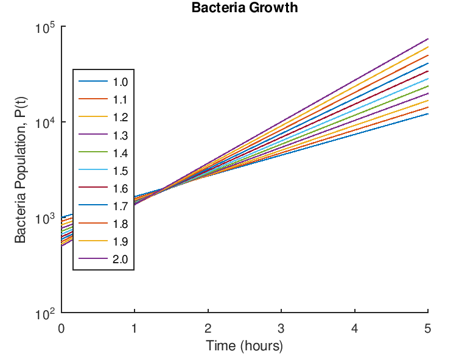

# Octave Notebook
<!-- padding: 30px !important -->

<!-- Button for download -->
<div class="text-center" style="text-align: center;">
   <form method="get" action="./index.md">
      <button type="submit">Download this File in Markdown!</button>
   </form>
   <br/>
   <p>or </p>
   <p>View this interactively at <a href="https://tweoss.github.io/octave/"> https://tweoss.github.io/octave/ </a><b>Strongly Recommended</b></p>
</div>

---
## Table of Contents

@import "[TOC]" {cmd="toc" depthFrom=1 depthTo=6 orderedList=false}

<!-- code_chunk_output -->

- [Octave Notebook](#octave-notebook)
  - [Table of Contents](#table-of-contents)
  - [Demonstration Text](#demonstration-texttable-of-contents)
  - [Preprinted Tabs](#preprinted-tabstable-of-contents)
  - [Syllabus](#syllabustable-of-contents)
  - [Lab 1](#lab-1table-of-contents)
    - [General Commands](#general-commandslab-1table-of-contents)
      - [Commands](#commands)
      - [Output](#output)
  - [Lab 2](#lab-2table-of-contents)
    - [Variables](#variableslab-2table-of-contents)
      - [Commands](#commands-1)
      - [Output](#output-1)
    - [Complex Numbers](#complex-numberslab-2table-of-contents)
      - [Commands](#commands-2)
      - [Output](#output-2)
    - [Arrays](#arrayslab-2table-of-contents)
      - [Commands](#commands-3)
      - [Output](#output-3)
    - [Polynomial Roots](#polynomial-rootslab-2table-of-contents)
      - [Commands](#commands-4)
      - [Output](#output-4)
    - [Plotting](#plottinglab-2table-of-contents)
      - [Commands](#commands-5)
      - [Output](#output-5)
    - [Examples](#exampleslab-2table-of-contents)
      - [Square Root](#square-rootexampleslab-2table-of-contents)
        - [Commands](#commands-6)
        - [Output](#output-6)
      - [Population Table](#population-tableexampleslab-2table-of-contents)
        - [Commands](#commands-7)
        - [Output](#output-7)
      - [Average per Game](#average-per-gameexampleslab-2table-of-contents)
        - [Commands](#commands-8)
        - [Output](#output-8)
      - [Projectile Motion](#projectile-motionexampleslab-2table-of-contents)
        - [Commands](#commands-9)
        - [Output](#output-9)
  - [Lab 3](#lab-3table-of-contents)
      - [Question 1](#question-1lab-3table-of-contents)
      - [Question 2](#question-2lab-3table-of-contents)
      - [Question 3](#question-3lab-3table-of-contents)
      - [Question 4](#question-4lab-3table-of-contents)
      - [Question 5](#question-5lab-3table-of-contents)
      - [Question 6](#question-6lab-3table-of-contents)
  - [Lab 4](#lab-4table-of-contents)
    - [Exercises Pg 21](#exercises-pg-21lab-4table-of-contents)
      - [Commands](#commands-10)
      - [Output](#output-10)
    - [Exercises Pg 25](#exercises-pg-25lab-4table-of-contents)
      - [Commands](#commands-11)
      - [Output](#output-11)
  - [Lab 5](#lab-5table-of-contents)
    - [Pg 28 Plot Example](#pg-28-plot-examplelab-5table-of-contents)
      - [Commands](#commands-12)
      - [Output](#output-12)
    - [Pg 32 Explanation](#pg-32-explanationlab-5table-of-contents)
      - [Commands](#commands-13)
      - [Output](#output-13)
    - [Pg 29 Exercise 2.3 Lesson 3](#pg-29-exercise-23-lesson-3lab-5table-of-contents)
      - [Commands](#commands-14)
      - [Output](#output-14)
    - [Pg 33 Exercises 2.4 Lesson 4](#pg-33-exercises-24-lesson-4lab-5table-of-contents)
      - [Commands](#commands-15)
      - [Output](#output-15)
    - [Bearing](#bearinglab-5table-of-contents)
      - [Commands](#commands-16)
      - [Output](#output-16)
    - [Page 37](#page-37lab-5table-of-contents)
      - [Commands](#commands-17)
      - [Output](#output-17)
  - [Lab 6](#lab-6table-of-contents)
    - [Textbook Problems](#textbook-problemslab-6table-of-contents)
      - [Commands](#commands-18)
      - [Output](#output-18)
  - [Lab 7](#lab-7table-of-contents)
    - [Script File](#script-filelab-7table-of-contents)
      - [Commands](#commands-19)
      - [Output](#output-19)
    - [Function File](#function-filelab-7table-of-contents)
      - [Commands](#commands-20)
      - [Output](#output-20)
    - [Profiling](#profilinglab-7table-of-contents)
      - [Commands](#commands-21)
      - [Output](#output-21)
    - [Global Variables](#global-variableslab-7table-of-contents)
      - [Commands](#commands-22)
      - [Output](#output-22)
    - [While loops](#while-loopslab-7table-of-contents)
      - [Commands](#commands-23)
      - [Output](#output-23)
    - [Switch, if, keyboard](#switch-if-keyboardlab-7table-of-contents)
      - [Commands](#commands-24)
      - [Output](#output-24)
    - [Demonstration Script](#demonstration-scriptlab-7table-of-contents)
      - [Commands](#commands-25)
      - [Output](#output-25)
  - [Lab 8](#lab-8table-of-contents)
    - [Linear Regression](#linear-regressionlab-8table-of-contents)
      - [Commands](#commands-26)
      - [Output](#output-26)
  - [Lab 10](#lab-10table-of-contents)
    - [Data Manipulation](#data-manipulationlab-10table-of-contents)
      - [Commands](#commands-27)
      - [Output](#output-27)
    - [Script Files](#script-fileslab-10table-of-contents)
      - [Commands](#commands-28)
      - [Output](#output-28)
    - [Miscellaneous Commands](#miscellaneous-commandslab-10table-of-contents)
      - [Commands](#commands-29)
      - [Output](#output-29)
    - [Classes](#classeslab-10table-of-contents)
      - [Commands](#commands-30)
      - [Output](#output-30)
    - [Sizes](#sizeslab-10table-of-contents)
      - [Commands](#commands-31)
      - [Output](#output-31)
    - [Sparse Cell](#sparse-celllab-10table-of-contents)
      - [Commands](#commands-32)
      - [Output](#output-32)
    - [Arbitrary Fields](#arbitrary-fieldslab-10table-of-contents)
      - [Commands](#commands-33)
      - [Output](#output-33)
    - [Extract Every Other](#extract-every-otherlab-10table-of-contents)
      - [Commands](#commands-34)
      - [Output](#output-34)
    - [Matrix Generating](#matrix-generatinglab-10table-of-contents)
      - [Commands](#commands-35)
      - [Output](#output-35)
    - [Tables](#tableslab-10table-of-contents)
      - [Commands](#commands-36)
      - [Output](#output-36)
  - [Lab 11](#lab-11table-of-contents)
    - [Loops](#loopslab-11table-of-contents)
      - [Commands](#commands-37)
      - [Output](#output-37)
    - [Conditionals](#conditionalslab-11table-of-contents)
      - [Commands](#commands-38)
      - [Output](#output-38)
    - [Image](#imagelab-11table-of-contents)
      - [Commands](#commands-39)
      - [Output](#output-39)
  - [Lab 12](#lab-12table-of-contents)
    - [The Great Bike Race](#the-great-bike-racelab-12table-of-contents)
      - [Commands](#commands-40)
      - [Output](#output-40)
    - [Simultaneous Arrival Plot](#simultaneous-arrival-plotlab-12table-of-contents)
      - [Commands](#commands-41)
      - [Output](#output-41)
  - [Lab Extra](#lab-extratable-of-contents)
    - [Debugging](#debugginglab-extratable-of-contents)
    - [File System](#file-systemlab-extratable-of-contents)
      - [Commands](#commands-42)
      - [Output](#output-42)
    - [Geometric Sum](#geometric-sumlab-extratable-of-contents)
      - [Commands](#commands-43)
      - [Output](#output-43)
    - [Bacteria Outbreak](#bacteria-outbreaklab-extratable-of-contents)
      - [Commands](#commands-44)
      - [Output](#output-44)

<!-- /code_chunk_output -->

---

## [Demonstration Text](#table-of-contents)

````markdown
## [Lab 1](#table-of-contents)
### [General Commands](#lab-1table-of-contents)
#### Commands
```matlab
x = 3
y = x + 1
clc # does nothing in script?
clear x
y
6*10/13+18/(5*7)+5*9^2
6*(35^(1/4))+14^0.35
6*(35^(1/4));
x = [-1:0.5...
:0.51]
quit
```
#### Output
```matlab
x = 3
y = 4
y = 4
ans = 410.13
ans = 17.112
x =

  -1.0000  -0.5000        0   0.5000
```
````

---
## [Preprinted Tabs](#table-of-contents)
|                                  |                           | NOTEBOOK GRADING SHEET            |               |                        |                              | ENGR 60                           |        |
| -------------------------------- | ------------------------- | --------------------------------- | ------------- | ---------------------- | ---------------------------- | --------------------------------- | ------ |
|                                  | **SCORE**             |                                   | **SCORE** | **NOTES**          |                              | **SCORE**                     |
| **Contents**                 |                           |                                   |               |                        |                              |                                   |        |
| Cover - Front & Side             |                           |                                   |               |                        |                              | **Week 9 Midterm Prep**       |        |
| Table of Contents                |                           |                                   |               |                        |                              | Midterm Prep                      |        |
| Preprinted Tabs                  |                           |                                   |               |                        |                              | Midterm                           |        |
| Syllabus                         |                           |                                   |               |                        |                              |                                   |        |
|                                  |                           |                                   |               |                        | p77                          | **Tab #10**                   |        |
| **Tab  #1 Overview**         |                           | **Pratap Tab  #6 Tutorial 5** |               | end of Ch2             | Solvex.m p78-79              | 4.1 Script files                  |        |
| T1-1 (a,b)                       |                           | 1\. On-line help                  |               | prob pg 37             | p80-81                       | 4.2 Function Files                | XXXXXX |
| Cylinder 20% increase            |                           | 2\. Convert temperature           |               | ans pg 38              | Example p82-83               | 4.2.1 Execute a Function          |
| T1-2 (x+y; xy; x/y)              |                           | 3.Calculate Factorials            |               |                        | eval w/feval p85             | Evaluating a Function             |        |
| 5 sin(u) u(7) length(w)          |                           | 4\. Cross-Product                 |               |                        | p87-88                       | Profiler                          |        |
| T3-1 25th Element                |                           | 5.Sum Geo series                  |               |                        | Control-flow p90             | 4.3.4 Loops Branches              |        |
| Polynomial Roots                 |                           | 6\. Interest Calculation          |               | see also Tab#3 "Money" | for loop  (pg 91)            |                                   |
| T3-2 Polynomia x^3..290          |                           |                                   |               |                        |                              | Great Bike Race                   |        |
| Plot y=sin(2*x)                 |                           | **Tab  #7**                   |               |                        |                              | B737 Max 8                        |        |
| T3-3 Plot s=2sin(3t+2)           |                           | Forecasting - Trend Line          |               |                        |                              | **SDC BOOK**                  |        |
| T3-4 y=4sqrt(6x\_1)              |                           |                                   |               |                        |                              | **Chapter 1 - Intro Load**    | XXXXXX |
| Plot Rocket Height               |                           | **Tab #7 Ch. 3**              |               |                        | Matirx input                 | Load Bearingdata  Save            |        |
| Script SampleSQRT                |                           | Ch. 3 How-to                      |               | p41-42                 | Matrix  manipulation         | Basic Statistical Function        |
| Script PopTable                  |                           | 3.1.1 Input & Continuation        | p45 Fig 3.1   | EXAMPLE                | Running the Script Vt        |                                   |
| Script Powers of 3               |                           | 3.1.2 Indexing/Subscript          |               | p.44                   | Continuation . . .           | Converting Values                 |        |
| Script A/g per Game              |                           | 3.1.2 Dimension                   |               | p46                    | Input: Vector  \[  \]        | **Chapter 2 - Programming**   | XXXXXX |
| Narrative                        |                           | 3.1.3 Matrix manipulation         | p47           | Matrix Reshaping       | Arithmetic/Relational        |                                   |
|                                  |                           | Transpose - Initiialization       |               | p.48                   | size(A)                      | Logical-Variable Naming           |        |
| **Tab #2 Matrix Math**       |                           | Appending - Deleting              |               | p.49                   |                              | Storing Numeric Values            |        |
| 4 hr Video (Hr 1 Vectors)        |                           | Utility - Special                 |               | p.50                   | zeroes(1,10); ones(10,1)     | Constants/Numerical Func          |        |
| Matlab Coursework Notes          |                           | Utility Matrix example            |               | p.51 Fig 3.2           | EXAMPLE eye(3) diag(B)       | Strings/Char                      |        |
|                                  |                           | 3.1.4 Creating Vecors             |               | p52                    | linspace(0,20,5) logsp       | Import Genetic Data               |        |
| **Pratap Tab #2 Tutorial 1** |                           | 3.2.1 Matrix  & Array Op          | XXXXXX        | p53                    | .*   .\\   ./   .^    .'    | **Chapter 3 - Programming**   | XXXXXX |
| 1\. compare; sqrt; pi            |                           | 3.2.2 Relational Ops              | XXXXXX        | p54                    | <,<= >,>=,==,~=              | Array Types                       |        |
| 2\. Exponents & Log (a,b,c)      | Matrix transpose, .*  .^ |                                   | p55 Fig 3.3   | EXAMPLE                | Strings as Matrices          |                                   |
| 3\. Trig (a, b, c)               |                           |                                   |               |                        |                              | : ; randi() magic()               |        |
| 4\. Complex No. (a,b,c)          |                           | **Tab #8**                    |               |                        |                              | Cell Arrays - Structures          |        |
|                                  |                           | 3.2.3 Logical Ops                 |               | p56                    | & (and) | (or)  ~ (not)      | Tables                            |        |
| **Pratap Tab #3 Tutorial 2** |                           | 3.2.4 Trig Functions              |               | p57                    | sin  cos  tan  cot  asin     | **Chapter 4 - Programming**   | XXXXXX |
| 1\. Equation of Line             |                           | exponent & complex func           | p58           |                        | While Loops                  |                                   |
| 2\. Vectors (a,b,c)              |                           | round off functions               |               | p59                    |                              | For Loops                         |        |
| 3\. Points on Circle             |                           | 3.2.5 Matrix functions            |               | p59                    |                              | If - Else Conditionals            |        |
| 4\. Geometric Series             |                           | 3.2.6 Character strings           |               | p59,61                 | nam=['Doe'; 'Ravi']       | If - Else - If Swith-Case         |        |
| 5\. Matrices & Vectors           |                           | Matrix function vs Array          |               | p60 Fig 3.4            | EXAMPLE                      | Editor TerminalVelocity           |        |
|                                  |                           | Manipulating char strings         |               | p61                    |                              | Image File - Pretty               |        |
| **Tab  #3**                  |                           | Eval function                     |               | p.62-63                | strcmp, num2str              | Exiting Stopping a Loop           |        |
| Time Value Money CANVAS          | 3.3 Functions and Help    |                                   | p64           |                        | **Chapter 5 - Matrices** | XXXXXX                            |
|                                  |                           | Help Directory                    | XXXXXX        | p65 Fig 3.5            | Size, diag, eye, magic       |                                   |
| **Pratap Tab #4 Tutorial 3** |                           | determinant help,  eig            | XXXXXX        | p66-69                 |                              | Scalar math -  .*   ./           |        |
| 1\. Simple Sin Plot              |                           |                                   | XXXXXX        |                        |                              | Transpositions                    |        |
| 2\. Line Styles                  |                           |                                   | XXXXXX        |                        |                              | Exponents, Logical ops            |        |
| 3\. Decay Sin Plot               |                           |                                   | XXXXXX        |                        |                              | **Chap 6 - Function, Script** | XXXXXX |
| 4 Space Curve                    |                           |                                   |               |                        |                              | Script - Interactive              |        |
| 5\. On-line Help                 |                           | 3.4 Saving Loading Data           | XXXXXX        |                        |                              | Functions Built-in                |        |
| 6\. Log scale Plots              |                           | 3.4.1 Loading mat files           | XXXXXX        |                        |                              | Fuction - Format                  |        |
| 7\. Overlay Plots                |                           |                                   |               |                        |                              | Function Algorithm Code           |        |
| 8\. 9. Own Plots                 |                           | 3.4.2 Recording w/diary           |               | p70                    |                              | **Scope - Recursion**         |        |
|                                  |                           | 3.5 Plotting                      |               | p71-73                 |                              | Chap 7 - Debugging                | XXXXXX |
| **Pratap Tab #5 Tutorial 4** |                           |                                   |               |                        |                              | Debugger                          |        |
| 1\. Center of Circle             |                           | **Matrix Exercises**          |               | p.74                   |                              | Break Points                      |        |
| 2\. Change radius of Circle      |                           | 1\. Entering Matrices             |               |                        |                              | Error Handle - Comments           |
| 3\. Variables in workspace       |                           | 2.Linear Algebra Rules            | XXXXXX        |                        |                              | **Chap 8 -Import/Export**     | XXXXXX |
| 4\. Contents of file "type"      |                           | 3\. Create matrices               |               |                        |                              | ls mkdir * path                  |        |
| 5\. H1 line                      |                           | 4.Matrices -Sub-matrices          |               |                        |                              | importing - exporting             |        |
| 6\. Just for Fun script file     |                           | 5.Manipulate a matrix             |               |                        |                              | **Chap 9 - Plotting & Data**  | XXXXXX |
| Bearing.mat CANVAS               |                           | 6.See the structures              |               |                        |                              | Plotting                          |        |
| Your Own Project                 |                           | 7\. Create a symmetric matrix     |               |                        | **Chap 10 - Tools**      | XXXXXX                            |
|                                  |                           | 8\. Do some cool ops              |               |                        |                              | Tools                             |        |
|                                  |                           |                                   |               |                        |                              | **Chap 11 - Symbolic Math**   |        |
| TOTAL COLUMN ONE                 |                           | TOTAL COLUMN TWO                  |               |                        |                              | TOTAL COLUMN THREE                |        |

---

## [Syllabus](#table-of-contents)

<!-- <div style="page-break-after: always"></div> -->

<object data="./assets/Engineering_60_Notebook_Syllabus.pdf" type="application/pdf" width="100%" height="600px">
   <embed src="./assets/Engineering_60_Notebook_Syllabus.pdf">
   <p>This browser does not support PDFs. Please download the PDF to view it: <a href="https://tweoss.github.io/octave/assets/Engineering_60_Notebook_Syllabus.pdf">tweoss.github.io/octave/assets/Engineering_60_Notebook_Syllabus.pdf</a>.</p>
</object>

<!-- SYLLABUS -->

## [Lab 1](#table-of-contents)

### [General Commands](#lab-1table-of-contents)
#### Commands
```matlab
x = 3
y = x + 1
clc # does nothing in script?
clear x
y
6*10/13+18/(5*7)+5*9^2
6*(35^(1/4))+14^0.35
6*(35^(1/4));
x = [-1:0.5...
:0.51]
quit
```
#### Output
```matlab
x = 3
y = 4
y = 4
ans = 410.13
ans = 17.112
x =

  -1.0000  -0.5000        0   0.5000
```

---
## [Lab 2](#table-of-contents)

### [Variables](#lab-2table-of-contents)
#### Commands
```matlab
r = 8;
h = 15;
V = pi * r ^ 2 * h;
V = V + 0.2 * V;
r = sqrt(V/(pi*h))
```
#### Output
```matlab
r = 8.7636
```

### [Complex Numbers](#lab-2table-of-contents)
#### Commands
```matlab
x = -5 + 9i;
y = 6 - 2i;
whos
x + y
x*y
x/y
```
#### Output
```matlab
Variables visible from the current scope:

variables in scope: top scope

   Attr Name        Size                     Bytes  Class
   ==== ====        ====                     =====  ===== 
   c    x           1x1                         16  double
   c    y           1x1                         16  double

Total is 2 elements using 32 bytes

ans =  1 + 7i
ans = -12 + 64i
ans = -1.2000 + 1.1000i
```

### [Arrays](#lab-2table-of-contents)
#### Commands
```matlab
u = [0: 0.1 :10];
w = 5 * sin(u);
u(7)
w(7)
m = length(w)
v = cos(0): 0.02 :log10(100);
length(v)
v(25)
```
#### Output
```matlab
ans = 0.6000
ans = 2.8232
m = 101
ans = 51
ans = 1.4800
```

### [Polynomial Roots](#lab-2table-of-contents)
#### Commands
```matlab
a = [1,-7,40,-34];
roots(a)
```
#### Output
```matlab
ans =

   3.0000 + 5.0000i
   3.0000 - 5.0000i
   1.0000 +      0i
```

### [Plotting](#lab-2table-of-contents)
#### Commands
```matlab
x = [0:0.1:52];
y = 0.4*sqrt(1.8*x);
plot(x,y),xlabel('Distance (miles'),ylabel('height (miles)'),...
title('Rocket Height as a function of Downrange Distance')
pause
```
#### Output


### [Examples](#lab-2table-of-contents)
#### [Square Root](#exampleslab-2table-of-contents)
##### Commands
```matlab
x = [1:10];
y = sqrt(x)
```
##### Output
```matlab
y =

 Columns 1 through 8:

   1.0000   1.4142   1.7321   2.0000   2.2361   2.4495   2.6458   2.8284

 Columns 9 and 10:

   3.0000   3.1623
```
#### [Population Table](#exampleslab-2table-of-contents)
##### Commands
```matlab
yr = [1984 1986 1988 1990 1992 1994 1996];
pop = [127 130 136 145 158 178 211];
tableYP(:,1) = yr';
tableYP(:,2) = pop';
disp('')
disp('   YEAR    POPULATION')
disp('           (MILLIONS)')
disp('')
disp(tableYP)
disp('')
```
##### Output
```matlab

   YEAR    POPULATION
         (MILLIONS)

   1984    127
   1986    130
   1988    136
   1990    145
   1992    158
   1994    178
   1996    211
```
#### [Average per Game](#exampleslab-2table-of-contents)
##### Commands
```matlab
number1 = input('Enter the points scored in the first game: ');
if number1 < 0
   disp('Warning! Input Invalid. Using absolute value.')
   number1 *= -1;
end
number2 = input('Enter the points scored in the second game: ');
if number2 < 0
   disp('Warning! Input Invalid. Using absolute value.')
   number2 *= -1;
end
number3 = input('Enter the points scored in the third game: ');
if number3 < 0
   disp('Warning! Input Invalid. Using absolute value.')
   number3 *= -1;
end

disp('The average of points scored is ')
disp((number1 + number2 + number3)/3)
```
##### Output
```matlab
Enter the points scored in the first game: -1
Warning! Input Invalid. Using absolute value.
Enter the points scored in the second game: 2
Enter the points scored in the third game: 0
The average of points scored is 
1
```
#### [Projectile Motion](#exampleslab-2table-of-contents)
##### Commands
```matlab
speed = input('Speed: ');
gravity = -9.81;
startHeight = input('Starting Height: ');
angle = input('Starting Angle in Radians: ');
disp('');
angle
horizontalVelocity = speed * cos(angle)
verticalVelocity = speed * sin(angle)
timeInFlight = verticalVelocity/(abs(gravity/2))
horizontalVelocity = timeInFlight * horizontalVelocity
disp('');
```
##### Output
```matlab
Speed: 50
Starting Height: 0
Starting Angle in Radians: pi/4

angle = 0.7854
horizontalVelocity = 35.355
verticalVelocity = 35.355
timeInFlight = 7.2080
horizontalVelocity = 254.84
```

---
## [Lab 3](#table-of-contents)

#### [Question 1](#lab-3table-of-contents)
| Enter your House Information here. |                 |      |        |
|------------------------------------|-----------------|------|--------|
| Style                              | Condo           | BD   | 2      |
| County                             | Santa Clara, CA | TB   | 2      |
| Sq. Feet                           | 950             | Acrq | 0.0219 |

#### [Question 2](#lab-3table-of-contents)
| **15-Year Mortgage Loan Details** |           |
|-------------------------------|-----------|
| Select a Bank Option:         | Bank 1    |
| Closing Costs Fees:           | $1,400.00 |
| Closing Costs Points:         | 1.0       |
| Loan Interest Rate:           | 3.890%    |

| **30-Year Mortage Loan Details**  |           |
|-------------------------------|-----------|
| Select a Bank Option:         |  Bank 1   |
| Closing Costs Fees:           | $1,700.00 |
| Closing Costs Points:         | 1.3       |
| Loan Interest Rate:           | 4.59%     |

#### [Question 3](#lab-3table-of-contents)
| House Listing Price |  $849,000.00  |
|---------------------|---------------|
| Down Payment        |  $170,000.00  |
| Closing Costs       | $8,190.00     |
| Total Loan Amount   |  $687,190.00  |
| APR                 | 3.89%         |
| Loan Term (months)  | 180           |
| Monthly Payment     | $5,045.26     |
| Total Payments      |  $908,147.57  |
| Total Interest      |  $220,957.57  |

#### [Question 4](#lab-3table-of-contents)
| House Listing Price |  $849,000.00    |
|---------------------|-----------------|
| Down Payment        |  $170,000.00    |
| Closing Costs       |  $10,187.50     |
| Total Loan Amount   |  $689,187.50    |
| APR                 | 4.59%           |
| Loan Term (months)  | 360             |
| Monthly Payment     | $3,528.96       |
| Total Payments      |  $1,270,426.79  |
| Total Interest      |  $581,239.29    |

#### [Question 5](#lab-3table-of-contents)
| 15-year vs. 30-year Mortgage Comparison     |                    |
|---------------------------------------------|--------------------|
| Which loan has the higher monthly payment?  |  15-year Mortgage  |
| How much higher per month is the payment?   | $1,516.30          |
| Which loan has more total interest paid?    |  30-year Mortgage  |
| How much more total interest is paid?       | $360,281.71        |


| Equity Comparison                           |               |
|---------------------------------------------|---------------|
| Suppose you sell your home at year 10 for $1018800. After you repay the remaining balance of your home, any money you have left over is called equity. The following questions help you compare the equity in your home after 10 years. |  |
| 15-year loan ending balance at year 10?     |  $274,692.95  |
| 30-year loan ending balance at year 10?     |  $553,547.39  |
| 15-year loan equity at year 10?             |  $744,107.05  |
| 30-year loan equity at year 10?             |  $465,252.61  |

#### [Question 6](#lab-3table-of-contents)
While the 15-year mortgage seems objectively better as I would have to pay less in the long term, if I were to purchase the house right now, I would be unable to pay the higher monthly payments. Instead of purchasing a house immediately, I could try to save money now and later take out a 15-year loan.

---
## [Lab 4](#table-of-contents)

### [Exercises Pg 21](#lab-4table-of-contents)

#### Commands
```matlab
2^5/(2^5-1)
(1-1/2^5)^1
3*(sqrt(5)-1)/(sqrt(5)+1)^2-1
r = pi^(1/3)-1
pi*r^2

disp('')

exp(3)
log(exp(3))
log10(exp(3))
log10(10^5)
exp(pi*sqrt(163))
fsolve(@(x) [3^x-17],0)
log(17)/log(3)

disp('')

sin(pi/6)
cos(pi)
tan(pi/2)
sin(pi/6)^2 + cos(pi/6)^2
x = 32*pi;
y = cosh(x)^2-sinh(x)^2

disp('')

(1+3i)/(1-3i)
e^(i*pi/4)
cos(pi/4)+i*sin(pi/4)
exp(pi/2*i)
exp(pi/2i)
disp('pi/2i => pi/(2*i) != pi/2*i')
```
$$\dfrac{1+3i}{1-3i} = \dfrac{(1+3i)(1+3i)}{(1-3i)(1+3i)} = \dfrac{1+6i-9}{1-(-9)} = \dfrac{-8+6i}{10} = -0.8+.6i$$
#### Output
```matlab
ans = 1.0323
ans = 0.9688
ans = -0.6459
r = 0.4646
ans = 0.6781

ans = 20.086
ans = 3
ans = 1.3029
ans = 5
ans = 2.6254e+17
ans = 2.5789
ans = 2.5789

ans = 0.5000
ans = -1
ans = 1.6331e+16
ans = 1
y = 0

ans = -0.8000 + 0.6000i
ans =  0.7071 + 0.7071i
ans =  0.7071 + 0.7071i
ans =  6.1232e-17 + 1.0000e+00i
ans =  6.1232e-17 - 1.0000e+00i
pi/2i => pi/(2*i) != pi/2*i
```

### [Exercises Pg 25](#lab-4table-of-contents)

#### Commands
```matlab
y = @(x) [0.5*x-2];
y(0), y(1.5), y(3), y(4), y(5), y(7), y(9), y(10)

disp('');

t = [1:10];
x = t.*sin(t)
y = (t-1)./(t+1)
z = sin(t.^2)./t.^2

disp('')

theta = [0; pi/4; pi/2; 3*pi/4; pi; 5*pi/4];
r = 2;
x = r*cos(theta)
y = r*sin(theta)
sqrt(x.^2 + y.^2)

disp('')

n = [0:10];
r = 0.5;
sum(r.^n)
1/(1-0.5)
n = [0:50];
sum(r.^n)
n = [0:100];
sum(r.^n)

disp('')

# no page 45 provided
v = 0:0.2:12;
M = [sin(v); cos(v)];
size(v), size(M)
M(1, 1:10)
M(2, 1:10)
```

#### Output
```matlab
ans = -2
ans = -1.2500
ans = -0.5000
ans = 0
ans = 0.5000
ans = 1.5000
ans = 2.5000
ans = 3

x =

 Columns 1 through 8:

   0.8415   1.8186   0.4234  -3.0272  -4.7946  -1.6765   4.5989   7.9149

 Columns 9 and 10:

   3.7091  -5.4402

y =

 Columns 1 through 8:

      0   0.3333   0.5000   0.6000   0.6667   0.7143   0.7500   0.7778

 Columns 9 and 10:

   0.8000   0.8182

z =

 Columns 1 through 6:

   8.4147e-01  -1.8920e-01   4.5791e-02  -1.7994e-02  -5.2941e-03  -2.7549e-02

 Columns 7 through 10:

  -1.9464e-02   1.4375e-02  -7.7764e-03  -5.0637e-03


x =

   2.0000e+00
   1.4142e+00
   1.2246e-16
  -1.4142e+00
  -2.0000e+00
  -1.4142e+00

y =

      0
   1.4142
   2.0000
   1.4142
   0.0000
  -1.4142

ans =

   2
   2
   2
   2
   2
   2


ans = 1.9990
ans = 2
ans = 2.0000
ans = 2

ans =

   1   61

ans =

   2   61

ans =

 Columns 1 through 8:

      0   0.1987   0.3894   0.5646   0.7174   0.8415   0.9320   0.9854

 Columns 9 and 10:

   0.9996   0.9738

ans =

 Columns 1 through 7:

   1.000000   0.980067   0.921061   0.825336   0.696707   0.540302   0.362358

 Columns 8 through 10:

   0.169967  -0.029200  -0.227202
```

---
## [Lab 5](#table-of-contents)

### [Pg 28 Plot Example](#lab-5table-of-contents)
#### Commands
```matlab
theta = linspace(0,2*pi,100);
x = cos(theta);
y = sin(theta);
plot(x,y)
axis('equal');
xlabel('x')
ylabel('y')
title('Circle of unit radius')
print # Did not make any action
pause; # So the program does not exit immediately.
```
#### Output


### [Pg 32 Explanation](#lab-5table-of-contents)
#### Commands
```matlab
% CIRCLE - A script file to draw a unit circle
% File written by Rudra Pratap. Last modified 6/28/98
% -------------------------
theta = linspace(0,2*pi,100);	% create vector theta
x = cos(theta);					% generate x-coordinates
y = sin(theta);					% generate y-coordinates
plot(x,y);
axis('equal');
title('Circle of unit radius')
```
#### Output
```matlab
octave:1> help circle
'circle' is a script from the file /Users/francischua/gitprojects/octave/circle.m

 CIRCLE - A script file to draw a unit circle
 File written by Rudra Pratap. Last modified 6/28/98
 -------------------------
```


### [Pg 29 Exercise 2.3 Lesson 3](#lab-5table-of-contents)
#### Commands
```matlab
x = linspace(0,2*pi,100);
y = sin(x);
plot(x,y); axis('equal');
title('Plot created by Francis'); xlabel('x'); ylabel('y');
pause
plot(x,y,'o'); axis('equal');
pause
plot(x,y,x,y,'o'); axis('equal');
pause;

theta = linspace(0,4*pi,100);
y = exp(-0.4*theta).*sin(theta);
 axis ([-1, 4*pi , -0.5, 10]);
plot(theta,y);
pause;

t = linspace(0,20,100);
x = sin(t); y = cos(t); z = t;
plot3(x,y,z);
pause;

help plot

x = linspace(0,10,1000);
y = x.^3;
semilogx(x,x,x,y);
pause;

x = linspace(0,pi,100);
plot(x,cos(x),x,1-x.^2/2+x.^4/24)
pause
```
#### Output


### [Pg 33 Exercises 2.4 Lesson 4](#lab-5table-of-contents)
#### Commands
```matlab
circle
who
whos
[theta' x' y']
type circle.m
lookfor unit

strftime ("%r %A %e %B %Y", localtime (time ()))
disp('____ is the cursed teacher.')
```
#### Output
```matlab
Enter the radius of the circle: 9

Variables visible from the current scope:

ans    r      theta  x      y

Variables visible from the current scope:

variables in scope: top scope

   Attr Name        Size                     Bytes  Class
   ==== ====        ====                     =====  ===== 
        ans         1x1                          8  double
        r           1x1                          8  double
        theta       1x100                      800  double
        x           1x100                      800  double
        y           1x100                      800  double

Total is 302 elements using 2416 bytes

ans =

        0   9.0000        0
   0.0635   8.9819   0.5708
   0.1269   8.9276   1.1393
   0.1904   8.8374   1.7033
   0.2539   8.7115   2.2603
   0.3173   8.5506   2.8083
   0.3808   8.3553   3.3450
   0.4443   8.1263   3.8682
   0.5077   7.8646   4.3758
   0.5712   7.5713   4.8658
   0.6347   7.2474   5.3362
   0.6981   6.8944   5.7851
   0.7616   6.5136   6.2107
   0.8251   6.1066   6.6113
   0.8885   5.6750   6.9853
   0.9520   5.2205   7.3312
   1.0155   4.7450   7.6475
   1.0789   4.2504   7.9331
   1.1424   3.7387   8.1867
   1.2059   3.2120   8.4073
   1.2693   2.6723   8.5941
   1.3328   2.1218   8.7463
   1.3963   1.5628   8.8633
   1.4597   0.9975   8.9445
   1.5232   0.4282   8.9898
   1.5867  -0.1428   8.9989
   1.6501  -0.7132   8.9717
   1.7136  -1.2808   8.9084
   1.7771  -1.8433   8.8092
   1.8405  -2.3983   8.6746
   1.9040  -2.9436   8.5050
   1.9675  -3.4771   8.3012
   2.0309  -3.9966   8.0639
   2.0944  -4.5000   7.7942
   2.1579  -4.9853   7.4931
   2.2213  -5.4505   7.1619
   2.2848  -5.8937   6.8017
   2.3483  -6.3133   6.4142
   2.4117  -6.7074   6.0009
   2.4752  -7.0745   5.5634
   2.5387  -7.4131   5.1035
   2.6021  -7.7219   4.6231
   2.6656  -7.9995   4.1240
   2.7291  -8.2450   3.6084
   2.7925  -8.4572   3.0782
   2.8560  -8.6354   2.5356
   2.9195  -8.7789   1.9828
   2.9829  -8.8869   1.4220
   3.0464  -8.9592   0.8555
   3.1099  -8.9955   0.2856
   3.1733  -8.9955  -0.2856
   3.2368  -8.9592  -0.8555
   3.3003  -8.8869  -1.4220
   3.3637  -8.7789  -1.9828
   3.4272  -8.6354  -2.5356
   3.4907  -8.4572  -3.0782
   3.5541  -8.2450  -3.6084
   3.6176  -7.9995  -4.1240
   3.6811  -7.7219  -4.6231
   3.7445  -7.4131  -5.1035
   3.8080  -7.0745  -5.5634
   3.8715  -6.7074  -6.0009
   3.9349  -6.3133  -6.4142
   3.9984  -5.8937  -6.8017
   4.0619  -5.4505  -7.1619
   4.1253  -4.9853  -7.4931
   4.1888  -4.5000  -7.7942
   4.2523  -3.9966  -8.0639
   4.3157  -3.4771  -8.3012
   4.3792  -2.9436  -8.5050
   4.4427  -2.3983  -8.6746
   4.5061  -1.8433  -8.8092
   4.5696  -1.2808  -8.9084
   4.6331  -0.7132  -8.9717
   4.6965  -0.1428  -8.9989
   4.7600   0.4282  -8.9898
   4.8235   0.9975  -8.9445
   4.8869   1.5628  -8.8633
   4.9504   2.1218  -8.7463
   5.0139   2.6723  -8.5941
   5.0773   3.2120  -8.4073
   5.1408   3.7387  -8.1867
   5.2043   4.2504  -7.9331
   5.2677   4.7450  -7.6475
   5.3312   5.2205  -7.3312
   5.3947   5.6750  -6.9853
   5.4581   6.1066  -6.6113
   5.5216   6.5136  -6.2107
   5.5851   6.8944  -5.7851
   5.6485   7.2474  -5.3362
   5.7120   7.5713  -4.8658
   5.7755   7.8646  -4.3758
   5.8389   8.1263  -3.8682
   5.9024   8.3553  -3.3450
   5.9659   8.5506  -2.8083
   6.0293   8.7115  -2.2603
   6.0928   8.8374  -1.7033
   6.1563   8.9276  -1.1393
   6.2197   8.9819  -0.5708
   6.2832   9.0000  -0.0000

circle.m is the user-defined function defined from: /Users/francischua/gitprojects/octave/circle.m

% CIRCLE - A script file to draw a unit circle
% File written by Rudra Pratap. Last modified 6/28/98
% -------------------------
r = input('Enter the radius of the circle: ');
theta = linspace(0,2*pi,100);   % create vector theta
x = r * cos(theta);                                     % generate x-coordinates
y = r * sin(theta);                                     % generate y-coordinates
plot(x,y);
hold on;
plot(0,0,'x');
axis('equal');
title('Circle of unit radius')
pause
I                   Return a scalar, matrix, or N-dimensional array whose eleme
                    nts are all equal to the pure imaginary unit, defined as
                    ��sqrt (-1)’.
luupdate            Given an LU factorization of a real or complex matrix A = L
                    *U, L lower unit trapezoidal and U upper trapezoidal, retur
                    rn the LU factorization of A + X*Y.
info                Display contact information for the GNU Octave community.
cylinder            Plot a 3-D unit cylinder.
sphere              Plot a 3-D unit sphere.
addtodate           Add Q amount of time (with units F) to the serial datenum, 
                    D.
circle              CIRCLE - A script file to draw a unit circle  File written 
                    by Rudra Pratap.
ans = 05:39:07 PM Thursday 11 March 2021
____ is the cursed teacher.
```

### [Bearing](#lab-5table-of-contents)
#### Commands
```matlab
load('assets/bearingdata.mat')
min(data)
bounds(data) # only does lowest
max(data)
mean(data)
median(data)
mode(data)
std(data)
var(data)
corrcoef(data)
cov(data)
```
#### Output
```matlab
ans = 2.3601
ans = 2.3601
ans = 2.3650
ans = 2.3623
ans = 2.3623
ans = 2.3601
ans = 1.4878e-03
ans = 2.2135e-06
ans = 1
ans = 2.2135e-06
```

### [Page 37](#lab-5table-of-contents)
#### Commands
```matlab
help disp
function temp = convert(Ti, Tf)
   C = [Ti: Tf]';
   F = 9/5*C + 32
   temp = [C F];
end
convert(-1, 10)

function output = fact(n)
   output = 1;
   while n > 1
      output *= n;
      n--;
   endwhile
end

fact(4)
fact(9)


function out = crossprod (u, v)
   out = [u(2)*v(3) - u(3)*v(2), u(3)*v(1) - u(1)*v(3), u(1)*v(2) - u(2)*v(1)];
end

crossprod([1,0,0], [0,1,0])
crossprod([0,1,0], [0,0,1])

function out = summer(r, n)
   out = (r^(n+1)-1)/(r-1);
end

summer(0.5, 5)
summer(1/3, 2)


function out = interest(X, n, r, k) 
   out = X * ((1+r/k)^(k*n)-1);
end

format bank
interest(1000,5,.06, 4)
interest(1000,5,.06, 365)
```
#### Output
```matlab
disp' is a built-in function from the file libinterp/corefcn/pr-output.cc

 -- disp (X)
 -- STR = disp (X)
     Display the value of X.

     For example:

          disp ("The value of pi is:"), disp (pi)

               -| the value of pi is:
               -| 3.1416

     Note that the output from 'disp' always ends with a newline.

     If an output value is requested, 'disp' prints nothing and returns
     the formatted output in a string.

     See also: fdisp.

Additional help for built-in functions and operators is
available in the online version of the manual.  Use the command
'doc <topic>' to search the manual index.

Help and information about Octave is also available on the WWW
at https://www.octave.org and via the help@octave.org
mailing list.
F =

   30.20
   32.00
   33.80
   35.60
   37.40
   39.20
   41.00
   42.80
   44.60
   46.40
   48.20
   50.00

ans =

   -1.00   30.20
       0   32.00
    1.00   33.80
    2.00   35.60
    3.00   37.40
    4.00   39.20
    5.00   41.00
    6.00   42.80
    7.00   44.60
    8.00   46.40
    9.00   48.20
   10.00   50.00

ans = 24.00
ans = 362880.00
ans =

      0      0   1.00

ans =

   1.00      0      0

ans = 1.97
ans = 1.44
ans = 346.86
ans = 349.83
```


---
## [Lab 6](#table-of-contents)

### [Textbook Problems](#lab-6table-of-contents)
#### Commands
```matlab
disp('pg 45')
A = [1 2 3; 4 5 6; 7 8 8]
A(2,3)
A(3,3) = 9
B = A(2:3, 1:3)
B = A(2:3, :)
B(:,2)=[]

disp('pg 51')
eye(3)
B = [ones(3) zeros(3,2); zeros(2,3) 4*eye(2)]
diag(B)'
diag(B,1)'
d = [2 4 6 8];
d1 = [-3 -3 -3];
d2 = [-1 -1];
D = diag(d) + diag(d1,1) + diag(d2, -2)

disp('pg 55')
A = [1 2 3; 4 5 6; 7 8 9];
x = A(1,:)'
x'*x
x*x'
A*x
A^2
A.^2

disp('pg 60')
A = [1 2; 3 4];
asqrt = sqrt(A)
Asqrt = sqrtm(A)
exp_aij = exp(A)
exp_A = expm(A)

disp('pg 68')
A = [5 -3 2; -3 8 4; 4 2 -9];
eig(A)
[eigvec, eigval] = eig(A)

disp('pg 72')
x = 0: .1: 20;
y = exp(0.1*x).*sin(x);
plot(x,y)
xlabel('Time (t) in Seconds')
ylabel('The Response Amplitude in mm')
title('A simple 2-D Plot')
print 'assets/resp_amp.eps' -deps

A = [2 6; 3 9]
B = [1 2; 3 4]
C = [-5 5; 5 3]
(A+B)-(B+A)
((A+B)+C)-(A+(B+C))
(5*(A+B))-(5*A+5*B)
A*(B+C) - (A*B + A*C)
A*B-A*C
A*B-B*A

zeros(2,3)
5*eye(3)
3*ones(2)

G = [A zeros(2,4); zeros(2) B zeros(2); zeros(2,4) C]
G(:,6) = []
G(6,:) = []
G(1:4,1:4)
G(5,5) = 4
G(13) # 1 is the 13 element as a flat vector
G(12,1) = 1 # increases size

A = ones(20);
A(6:15,6:15) = zeros(10);
spy(A) # bunch of stars with empty square in middle
A(16:20,1:5) = zeros(5);
A(1:5,16:20) = zeros(5);
spy(A)

A = diag(1:6) + diag(7:11,1) + diag(12:15,2)
A = A + triu(A,1)'

A = rand(10);
A = fix(A*100)
idx = A < 10;
A(idx) = 0;
idx = A > 90;
A(idx) = inf
idx = (A <= 50 & A >= 30);
b = A(idx)'

```
#### Output
```matlab

pg 45
A =

   1   2   3
   4   5   6
   7   8   8

ans = 6
A =

   1   2   3
   4   5   6
   7   8   9

B =

   4   5   6
   7   8   9

B =

   4   5   6
   7   8   9

B =

   4   6
   7   9

pg 51
ans =

Diagonal Matrix

   1   0   0
   0   1   0
   0   0   1

B =

   1   1   1   0   0
   1   1   1   0   0
   1   1   1   0   0
   0   0   0   4   0
   0   0   0   0   4

ans =

   1   1   1   4   4

ans =

   1   1   0   0

D =

   2  -3   0   0
   0   4  -3   0
  -1   0   6  -3
   0  -1   0   8

pg 55
x =

   1
   2
   3

ans = 14
ans =

   1   2   3
   2   4   6
   3   6   9

ans =

   14
   32
   50

ans =

    30    36    42
    66    81    96
   102   126   150

ans =

    1    4    9
   16   25   36
   49   64   81

pg 60
asqrt =

   1.0000   1.4142
   1.7321   2.0000

Asqrt =

   0.5537 + 0.4644i   0.8070 - 0.2124i
   1.2104 - 0.3186i   1.7641 + 0.1458i

exp_aij =

    2.7183    7.3891
   20.0855   54.5982

exp_A =

    51.969    74.737
   112.105   164.074

pg 68
ans =

  -10.2206
    4.4246
    9.7960

eigvec =

   0.172542   0.870606  -0.537542
   0.238228   0.377390   0.842875
  -0.955760   0.315629  -0.024708

eigval =

Diagonal Matrix

  -10.2206         0         0
         0    4.4246         0
         0         0    9.7960

pg 72
A =

   2   6
   3   9

B =

   1   2
   3   4

C =

  -5   5
   5   3

ans =

   0   0
   0   0

ans =

   0   0
   0   0

ans =

   0   0
   0   0

ans =

   0   0
   0   0

ans =

   0   0
   0   0

ans =

   12    4
   12  -12

ans =

   0   0   0
   0   0   0

ans =

Diagonal Matrix

   5   0   0
   0   5   0
   0   0   5

ans =

   3   3
   3   3

G =

   2   6   0   0   0   0
   3   9   0   0   0   0
   0   0   1   2   0   0
   0   0   3   4   0   0
   0   0   0   0  -5   5
   0   0   0   0   5   3

G =

   2   6   0   0   0
   3   9   0   0   0
   0   0   1   2   0
   0   0   3   4   0
   0   0   0   0  -5
   0   0   0   0   5

G =

   2   6   0   0   0
   3   9   0   0   0
   0   0   1   2   0
   0   0   3   4   0
   0   0   0   0  -5

ans =

   2   6   0   0
   3   9   0   0
   0   0   1   2
   0   0   3   4

G =

   2   6   0   0   0
   3   9   0   0   0
   0   0   1   2   0
   0   0   3   4   0
   0   0   0   0   4

ans = 1
G =

   2   6   0   0   0
   3   9   0   0   0
   0   0   1   2   0
   0   0   3   4   0
   0   0   0   0   4
   0   0   0   0   0
   0   0   0   0   0
   0   0   0   0   0
   0   0   0   0   0
   0   0   0   0   0
   0   0   0   0   0
   1   0   0   0   0

A =

    1    7   12    0    0    0
    0    2    8   13    0    0
    0    0    3    9   14    0
    0    0    0    4   10   15
    0    0    0    0    5   11
    0    0    0    0    0    6

A =

    1    7   12    0    0    0
    7    2    8   13    0    0
   12    8    3    9   14    0
    0   13    9    4   10   15
    0    0   14   10    5   11
    0    0    0   15   11    6

A =

    3    1   43   54   38   70   38   56   20   10
   43    9   98   53   42   10   92   67   39   14
   88   75   22    7   31   41   91   21   83   65
   18   56    8   86   54    4   97    7   27   15
   20   23    6   43   81   55   97   65   83   18
   98   93   76   94   44   99    4   26   65    9
   11   78   43   91   23   92   73   49   27   35
   24   78   26    5   83   85    9   16   86   52
   75   13   56   57   84    9   79   48   34   91
   12   38   62   50   11   22   62   39   42    2

A =

     0     0    43    54    38    70    38    56    20    10
    43     0   Inf    53    42    10   Inf    67    39    14
    88    75    22     0    31    41   Inf    21    83    65
    18    56     0    86    54     0   Inf     0    27    15
    20    23     0    43    81    55   Inf    65    83    18
   Inf   Inf    76   Inf    44   Inf     0    26    65     0
    11    78    43   Inf    23   Inf    73    49    27    35
    24    78    26     0    83    85     0    16    86    52
    75    13    56    57    84     0    79    48    34   Inf
    12    38    62    50    11    22    62    39    42     0

b =

   43   38   43   43   43   50   38   42   31   44   41   38   49   48   39   39   34   42   35

```

---
## [Lab 7](#table-of-contents)

### [Script File](#lab-7table-of-contents)
#### Commands
```matlab
%------------ This is the script file 'solvex.m' ------------
% It solves equation (4.1) for x and also calculates det(A).

A = [2 2*r r; 3 6 2*r-1; 2 r-1 3*r];
b = [2; 3; 5];
det_A = det(A);
x = A\b;

%----------------------- CLI Commands -----------------------
r = 1;
solvex
```
#### Output
```matlab
det_A = 10.000
x =

  -0.2000
   0.3000
   1.8000
```

### [Function File](#lab-7table-of-contents)
#### Commands
```matlab
%------------ This is the script file 'solvex.m' ------------
function [det_A, x] = solvexf(determinant_func, r);
% SOLVEXF solves a 3x3 watrix equation with parameter function
% To call this function, type:
% [det_A,x] = solvexf(determinant_func, r);
% r is the input and det_A and x are output
% -----------------------------------------------------
A = [2 2*r r; 3 6 2*r-1; 2 r-1 3*r];
b = [2; 3; 5];
det_A = feval(determinant_func,A)
x = A\b

%----------------------- CLI Commands -----------------------
[detA, x] = solvexf(@det, 1)
```
#### Output
```matlab
det_A = 10.000
x =

  -0.2000
   0.3000
   1.8000
```

### [Profiling](#lab-7table-of-contents)
#### Commands
```matlab
profile on
[detA, x] = solvexf(@det, 1)
profile off
profshow % shows the contents of the current profiling session
```
#### Output
```matlab
detA = 10.000
x =

  -0.2000
   0.3000
   1.8000

   #            Function Attr     Time (s)   Time (%)        Calls
------------------------------------------------------------------
   9             profile             0.000      23.76            1
   1             solvexf             0.000      21.38            1
   7             display             0.000      16.70            2
   8                disp             0.000      12.19            2
   5                 det             0.000      11.84            1
   4               feval             0.000       6.01            1
   6            binary \             0.000       4.06            1
  12               false             0.000       1.50            1
   2            binary *             0.000       0.80            3
  10              nargin             0.000       0.71            1
  11           binary !=             0.000       0.71            1
   3            binary -             0.000       0.35            2
  13 __profiler_enable__             0.000       0.00            1
```

### [Global Variables](#lab-7table-of-contents)
#### Commands
```matlab
%----------------------- Script File ------------------------
global k_value c_value;

function xdot = ode1(t,x);
% ODE1: function to compute the derivative xdot
global k_value c_value
xdot = k_value * x + c_value * sin(t);
end

k_value = 5; c_value = 2;
ts = [0 20];
x0 = 1.0;
[t, x] = ode23('ode1', ts, x0)
[t(1:10), x(1:10)]
```
#### Output
```matlab
ans =

        0   1.0000
   0.0178   1.0933
   0.0445   1.2510
   0.0845   1.5337
   0.1330   1.9662
   0.1841   2.5561
   0.2359   3.3370
   0.2881   4.3618
   0.3405   5.7031
   0.3930   7.4565
```

### [While loops](#lab-7table-of-contents)
#### Commands
```matlab
v = 1; i = 1; num = 0;
while num < 10000
   num = 2^i;
   v = [v; num];
   i = i + 1;
end
v
```
#### Output
```matlab
v =

       1
       2
       4
       8
      16
      32
      64
     128
     256
     512
    1024
    2048
    4096
    8192
   16384
```

### [Switch, if, keyboard](#lab-7table-of-contents)
#### Commands
```matlab
%------------- This is the script file 'work.m' -------------
A = ones(10)
for i = 1:10
   disp(i)
   if i == 5 
      keyboard
   elseif i==4
      for j=1:10
         switch mod(A(3,j),2)
            case 0
               A(4,j) = 1;
            case 1
               A (4,j) = -2;
         end
      end
   end
   A(:,i) = i*A(:,i);
end
%----------------------- CLI Commands -----------------------
work
keyboard> A
keyboard> return
A
```
#### Output
```matlab
octave:45>work
A =

   1   1   1   1   1   1   1   1   1   1
   1   1   1   1   1   1   1   1   1   1
   1   1   1   1   1   1   1   1   1   1
   1   1   1   1   1   1   1   1   1   1
   1   1   1   1   1   1   1   1   1   1
   1   1   1   1   1   1   1   1   1   1
   1   1   1   1   1   1   1   1   1   1
   1   1   1   1   1   1   1   1   1   1
   1   1   1   1   1   1   1   1   1   1
   1   1   1   1   1   1   1   1   1   1

1
2
3
4
5
stopped in solvexf at line 5 [~/octave/solvexf.m] 
5:              keyboard
keyboard> A
A =

   1   2   3   4   1   1   1   1   1   1
   1   2   3   4   1   1   1   1   1   1
   1   2   3   4   1   1   1   1   1   1
  -2   1  -2  -8  -2  -2  -2  -2  -2  -2
   1   2   3   4   1   1   1   1   1   1
   1   2   3   4   1   1   1   1   1   1
   1   2   3   4   1   1   1   1   1   1
   1   2   3   4   1   1   1   1   1   1
   1   2   3   4   1   1   1   1   1   1
   1   2   3   4   1   1   1   1   1   1

keyboard> return
6
7
8
9
10
octave:46> A
A =

    1    2    3    4    5    6    7    8    9   10
    1    2    3    4    5    6    7    8    9   10
    1    2    3    4    5    6    7    8    9   10
   -2    1   -2   -8  -10  -12  -14  -16  -18  -20
    1    2    3    4    5    6    7    8    9   10
    1    2    3    4    5    6    7    8    9   10
    1    2    3    4    5    6    7    8    9   10
    1    2    3    4    5    6    7    8    9   10
    1    2    3    4    5    6    7    8    9   10
    1    2    3    4    5    6    7    8    9   10
```

### [Demonstration Script](#lab-7table-of-contents)
#### Commands
```matlab
function [det_A, x] = solvexf(determinant_func);
   % SOLVEXF solves a 3x3 watrix equation with parameter function
   r = input('r: ');
   A = [5 2*r r; 3 6 2*r-1; 2 r-1 3*r] 
   b = [2;3;5];
   det_A = feval(determinant_func,det(A)) % uses a user defined function to compute determinant
   x = A\b;
   gain_control = input('Would you like to gain control? (y/n) ','s');
   switch gain_control
      case 'y'
         disp('Type "return" and hit RETURN to continue.');
         keyboard;
      case 'n'
         choice = menu('What would you like to do now?','Sleep','print ''x''');
         switch choice
            case 1
               disp('Goodnight')
               exit
            case 2
               x
               disp('.')
               pause(1)
               disp('.')
               pause(1)
               disp('.')
               pause(1)
               disp('GO SLEEP')
               exit
            end
      otherwise
         error('Invalid Choice');
   end
   disp('Continuing')
   FallSem(1).course = 'cs101';
   FallSem(1).prof = 'turing';
   FallSem(1).score = [80 75 95];
   FallSem
   FallSem(2).course = 'phy200';
   FallSem(2).prof = 'Fiegenbaum';
   FallSem(2).score = [72 75 78];
   FallSem
   FallSem(2).course
   container = cell(2,2);
   container{1,1} = FallSem(1);
   container{2,1} = FallSem(2);
   container{1,2} = 2;
   container{2,2} = 'a';
   container
end

solvexf('det');
```
#### Output
```matlab
Started execution
r: 1
A =

   5   2   1
   3   6   1
   2   0   3

det_A = 64
Would you like to gain control? (y/n) y
Type "return" and hit RETURN to continue.
stopped in solvexf at line 14 [/Users/francischua/gitprojects/octave/work.m] 
14:          keyboard;
keyboard> r     
r = 1
keyboard> return
Continuing
FallSem =

  scalar structure containing the fields:

    course = cs101
    prof = turing
    score =

       80   75   95


FallSem =

  1x2 struct array containing the fields:

    course
    prof
    score

ans = phy200
container =
{
  [1,1] =

    scalar structure containing the fields:

      course = cs101
      prof = turing
      score =

         80   75   95


  [2,1] =

    scalar structure containing the fields:

      course = phy200
      prof = Fiegenbaum
      score =

         72   75   78


  [1,2] = 2
  [2,2] = a
}
```

---
## [Lab 8](#table-of-contents)

### [Linear Regression](#lab-8table-of-contents)
#### Commands
```matlab
type forecasting_data.txt;
data = load("-ascii", "forecasting_data.txt");
n = size(data)(1)
AVG = mean(data)
SUM_SQUARE = var(data(:,1))*(n-1)
COV_N = sum((data(:,1) - AVG(1)) .* (data(:,2) - AVG(2)))
b = COV_N / SUM_SQUARE
a = AVG(2) - b * AVG(1)
epsilon = std(data(:,2))
% epsilon = sqrt(sum((data(:,2) - AVG(2)).^2)/(n-1)). This gives a different number from shown.
disp('68% confidence. r not calculated')
Y_low = a + b*2020 - epsilon
Y_high = a + b*2020 + epsilon
hold on 
scatter(data(:,1),data(:,2),'o')
plot([2012 2020],[2012*b + a, 2020*b + a])
plot([2020 2020], [Y_low, Y_high], 'go-')
plot([2020], [a + b*2020], 'bo')
hold off
xlabel('years')
xlabel('sales')
axis([2012,2021,10,70])
pause
```
#### Output
```matlab
2013    23
2014    18
2015    35
2016    39
2017    35
2018    37
2019    49
n = 7
AVG =

   2016.000     33.714

SUM_SQUARE = 28
COV_N = 116
b = 4.1429
a = -8318.3
epsilon = 10.307
68% confidence. r not calcualted
Y_low = 39.979
Y_high = 60.593
```


---
## [Lab 10](#table-of-contents)

### [Data Manipulation](#lab-10table-of-contents)
#### Commands
```matlab
# load data from bearingdata.mat
load('assets/bearingdata.mat')
# show the first few values of the data
data(1:5)
# perform transformation
data_grams = data * 28.35;
# show last few values of transformed data
data_grams(96:100)
# save the new data to a file
save('assets/bearing data_grams','data_grams')
# show the median of new data
median(data_grams)
# find the smallest and largest elements of the new data
[smallest,largest] = bounds(data_grams)
# show the use of format long
format long
ounce = 0.0283495;
data_kilograms = data * ounce;
data_kilograms(96:100)
```
#### Output
```matlab
ans =

   2.364942089643925
   2.362699910495190
   2.363534587096614
   2.364997458100488
   2.361439246724076

ans =

   66.99682176558042
   66.95260941494178
   66.99867785420295
   67.01218938489492
   66.98866657743373

ans = 66.97214821453088
smallest = 66.90746521565018
largest = 67.04767793714885
ans =

   6.699564016378561e-02
   6.695142859290623e-02
   6.699749621967289e-02
   6.701100751206626e-02
   6.698748511946939e-02

```

### [Script Files](#lab-10table-of-contents)
#### Commands
```matlab
# show and execute velocity.m
type velocity.m
velocity
# show and execute mars_velocity.m
type mars_velocity.m
mars_velocity
# show and execute rating_to_pound.m
type rating_to_pound.m
rating_to_pound
```
#### Output
```matlab
velocity.m is the user-defined function defined from: /Users/francischua/gitprojects/octave/velocity.m

# --- VELOCITY.M FILE --- #
dia = 2.5;
gravity = 981
%A = cross-sectional area or pi*((d/2)^2)  Note:  d/2 gives radius
area = pi*((dia/2)^2);
%m = mass of the falling object
mass = 65.4710;
%ρ = density (air = 1.225 kg/m^3) or .001225 gare/m^3
airDensity =0.001225;
%C = drag coefficient for  sphere is 0.47
C=0.47
% Vt = √(2mg)/(ρCA)
Vt = sqrt((2*mass*gravity)/(airDensity*C*area))
# --- VELOCITY.M FILE --- #
gravity = 981
C = 0.470000000000000
Vt = 6741.741030699041
mars_velocity.m is the user-defined function defined from: /Users/francischua/gitprojects/octave/mars_velocity.m

# --- MARS_VELOCITY.M FILE --- #
dia = .025;
gravity = 3.711;
area = pi*((dia/2)^2);
mass=65.4710;
airDensity = 20.;
C=0.47;
Vt=sqrt((2*mass*gravity)/(airDensity*C*area))
# --- MARS_VELOCITY.M FILE --- #
Vt = 324.5159789486731
rating_to_pound.m is the user-defined function defined from: /Users/francischua/gitprojects/octave/rating_to_pound.m

# --- RATING_TO_POUND.M --- #
lbf=224.809;
open = 6;
closed = 20;
openlbf = open * lbf;
closed =closed * lbf
# --- RATING_TO_POUND.M --- #
closed = 4496.180000000000
```

### [Miscellaneous Commands](#lab-10table-of-contents)
#### Commands
```matlab
# show int8 bounds (2^7 = 128)
x = int8(120) + int8(50)
# usage of fix
x = fix(3.4) + rem(5,2)
# usage of ceil
x = ceil(3.4) + rem(5,2)
# manipulate character array
st = '12345';
st(1)=72; st(2)=69; st(3)=76; st(4)=76; st(5)=79
# show string comparison
text1 = 'Four score';
text2 = '87 years ago';
text3 = 'Four score';
strcmp(text1, text2)
strcmp(text1, text3)
# strfind
text1 = 'Four score and seven years ago';
index = strfind(text1, 'seven')
# failing to add different integer types
% sum2=int16(5) + int8(3)
# load the io package and then the xlsx
pkg load io
A = xlsread('assets/ChromeExport2.xlsx');
A(1:5,:)
# logical operators
x = 1;
y = 5;
z = ~(x<y)||~(y <x) && islogical(x)
# typecast to unsigned int
x = 55 + uint32(-22) + pi
x = int8(ceil(rem(-528.6,200)))
# random integers, shows a 3d matrix
A = randi(15,4,5,2)
```
#### Output
```matlab
x = 127
x = 4
x = 5
st = HELLO
ans = 0
ans = 1
index = 16
ans =

         22   16050075        NaN        NaN        NaN        100
         22   16050115        NaN        NaN        NaN        100
         22   16050213        NaN        NaN        NaN        100
         22   16050319        NaN        NaN        NaN        100
         22   16050527        NaN        NaN        NaN        100

z = 0
x = 58
x = -128
A =

ans(:,:,1) =

    2    8    2   12    6
    3   14   12   14   12
   13   15   15   15   12
    8   10    7    7   12

ans(:,:,2) =

    8    3    2   15    5
    6   11    9   13    5
   13    1    6   13    8
   10    1   11   15   15
```

### [Classes](#lab-10table-of-contents)
#### Commands
```matlab
aScalar = int16(345);
string1 = 'To be or not to be';
aVector = int8(1:5);
aArray = [3,3];

class(aScalar)
class(string1)
class(aVector)
class(aArray)
```
#### Output
```matlab
ans = int16
ans = char
ans = int8
ans = double
```

### [Sizes](#lab-10table-of-contents)
#### Commands
```matlab
aScalar = int16(345);
string1 = 'To be or not to be';
aVector = int8(1:3);
aArray1 = randi(2,3);
aArray2 = [2,3];

size(aScalar)
size(string1)
size(aVector)
size(aArray1)
size(aArray2)
```
#### Output
```matlab
ans =

   1   1

ans =

    1   18

ans =

   1   3

ans =

   3   3

ans =

   1   2
```

### [Sparse Cell](#lab-10table-of-contents)
#### Commands
```matlab
b = cell(4,5);
b{1,1} = 'Good Morning';
b{1,2} = 'Bonjour';
b{3,4} = cos(45);
b{4,1} = int16(432);
b
```
#### Output
```matlab
b =
{
  [1,1] = Good Morning
  [2,1] = [](0x0)
  [3,1] = [](0x0)
  [4,1] = 432
  [1,2] = Bonjour
  [2,2] = [](0x0)
  [3,2] = [](0x0)
  [4,2] = [](0x0)
  [1,3] = [](0x0)
  [2,3] = [](0x0)
  [3,3] = [](0x0)
  [4,3] = [](0x0)
  [1,4] = [](0x0)
  [2,4] = [](0x0)
  [3,4] = 0.525321988817730
  [4,4] = [](0x0)
  [1,5] = [](0x0)
  [2,5] = [](0x0)
  [3,5] = [](0x0)
  [4,5] = [](0x0)
}
```

### [Arbitrary Fields](#lab-10table-of-contents)
#### Commands
```matlab
rocket.manufacturer = 'SpaceX'
```
#### Output
```matlab
rocket =

  scalar structure containing the fields:

    manufacturer = SpaceX
```

### [Extract Every Other](#lab-10table-of-contents)
#### Commands
```matlab
A1 = randi(8,8)
A2 = A1(2:2:8,2:2:8)
```
#### Output
```matlab
A1 =

   5   5   6   4   8   6   4   2
   4   2   7   8   4   6   6   3
   8   7   5   1   6   3   5   1
   5   4   4   5   4   5   1   8
   1   5   6   4   4   3   8   7
   8   6   4   2   7   2   1   4
   5   8   5   4   8   6   6   6
   5   6   2   1   8   3   7   2

A2 =

   2   8   6   3
   4   5   5   8
   6   2   2   4
   6   1   3   2
```

### [Matrix Generating](#lab-10table-of-contents)
#### Commands
```matlab
randi(2,3)
randi(2,2,3)
magic(3)
A = magic(4)
for i = 1:4 
   row = sum(A(i,:))
endfor
for i = 1:4 
   col = sum(A(:,i))
endfor
diagonal = A(1,1) + A(2,2) + A(3,3) + A(4,4)
diagonal = A(1,4) + A(2,3) + A(3,2) + A(4,1)
```
#### Output
```matlab
ans =

   2   1   1
   1   1   1
   2   2   1

ans =

   2   1   1
   2   1   2

ans =

   8   1   6
   3   5   7
   4   9   2

A =

   16    2    3   13
    5   11   10    8
    9    7    6   12
    4   14   15    1

row = 34
row = 34
row = 34
row = 34
col = 34
col = 34
col = 34
col = 34
diagonal = 34
diagonal = 34
```

### [Tables](#lab-10table-of-contents)
#### Commands
Octave does not currently support Tables.
#### Output

---
## [Lab 11](#table-of-contents)

### [Loops](#lab-11table-of-contents)
#### Commands
```matlab
x = 0;
while x<6
   x = x + 1;
   fprintf('x = %d\n',x);
endwhile
for x = 1:10 
   if x == 6
      break; 
   endif
   disp(x); 
endfor
```
#### Output
```matlab
x = 1
x = 2
x = 3
x = 4
x = 5
x = 6
1
2
3
4
5
```

### [Conditionals](#lab-11table-of-contents)
#### Commands
```matlab
octave_version = 6; os = 'mac';
if x < 3 
   disp('Get an ugrade')
else
   switch os
      case 'mac'
         disp('brew install octave')
      case 'windows'
         printf('Why do astronauts use Linux?\nBecause they can''t open Windows in space.\n');
      case 'linux'
         disp('"People assume that time is a strict progression of cause to effect but, actually, from a non-linear, non-subjective viewpoint - it''s more like a big ball of wibbly wobbly... time-y wimey... stuff." - The Doctor')
   end
endif
```
#### Output
```matlab
brew install octave
```

### [Image](#lab-11table-of-contents)
#### Commands
```matlab
imageFile = './assets/pretty.png'; 
ImageMap = imread(imageFile);
rows = size(ImageMap,1); 
columns = size(ImageMap,2);
if (rows > 0 && columns > 0) 
   y = 1; 
while y <= rows
   for x = 1:columns
      for i = 1:3
         ImageMap(y, x, i) = 255 - ImageMap(y, x, i); end
      end
      y = y + 1;
   end
   imwrite(ImageMap, imageFile);
end
```
#### Output


---
## [Lab 12](#table-of-contents)

### [The Great Bike Race](#lab-12table-of-contents)
#### Commands
```matlab
x = 0:20;
y = 2/7*x +6;
z = 3/5 * x + 2;
hold on;
plot(x,x,'b',x,y,'g',x,z,'r')
plot(42/5,42/5, 'go');
plot((6-2)/(3/5-2/7),(6-2)/(3/5-2/7)*2/7+6, 'go');
plot(5,5, 'ro');
hold off;
text (0,0,"Jill overtakes Elizabeth", "position", [4 9 0]);
text (0,0,"Kim overtakes Elizabeth", "position", [13 9 0]);
text (0,0,"Jill overtakes Kim", "position", [5.5 5 0]);
title ('The Great Bike Race');
xlabel('seconds'); ylabel('distance in meters');
```
#### Output


### [Simultaneous Arrival Plot](#lab-12table-of-contents)
#### Commands
```matlab
x_fighter = 0:10:300;
x_b7 = 30:10:300;
m_fighter = -600/60;
b_fighter = 2500;
minutes_taken_fighter = b_fighter / (-m_fighter);
minutes_taken_b7 = minutes_taken_fighter - 30;
m_b7 = -500/60;
b_b7 = - minutes_taken_b7 * m_b7;

y_fighter = x_fighter * m_fighter + b_fighter;
y_b7 = (x_b7 - 30) * m_b7 + b_b7;

plot(x_fighter,y_fighter,'b',x_b7,y_b7,'r')
title ('Simultaneous Arrival Time');
xlabel('minutes'); ylabel('distance from destination');
legend ("Fighter", "B737");
```
#### Output


---
## [Lab Extra](#table-of-contents)
Extra examples to demonstrate proficiency of skills in the check sheet.
### [Debugging](#lab-extratable-of-contents)


### [File System](#lab-extratable-of-contents)
#### Commands
```matlab
x = 1;
ls
mkdir temp_example
cd temp_example
save var_file x
type var_file
ls
cd ..
ls
```
#### Output
```text
MatlabNotesPadded.pdf   index.md                notes.m                 quizzes                 velocity.m
assets                  index.pdf               notes.pdf               rating_to_pound.m
index.html              mars_velocity.m         octave-workspace        regex.txt
# Created by Octave 6.1.0, Mon May 03 22:41:06 2021 PDT <francischua@Francis-MBP.local>
# name: x
# type: scalar
1


var_file
MatlabNotesPadded.pdf   index.md                notes.m                 quizzes                 temp_example
assets                  index.pdf               notes.pdf               rating_to_pound.m       velocity.m
index.html              mars_velocity.m         octave-workspace        regex.txt
```

### [Geometric Sum](#lab-extratable-of-contents)
#### Commands
```matlab
output_precision (10)
r = input('Ratio = ');
first_element = input('First Element = ');
approximation = 0;
for i = 0:10
  approximation += r^i * first_element;
endfor
approximation

exact = first_element / (1 - r)
```
#### Output
```matlab
Ratio = 0.523
First Element = 6
approximation = 12.56854352
exact = 12.578616350
```

### [Bacteria Outbreak](#lab-extratable-of-contents)
#### Commands
```matlab
x = 0:0.1:5;
title ('Bacteria Growth');
xlabel('Time (hours)'); ylabel('Bacteria Population, P(t)');
hold on;
for a = 1:0.1:2
  plot(x, 1000/a*exp(.5*a*x))
end
legend ("1.0", "1.1", "1.2", "1.3", "1.4", "1.5", "1.6", "1.7", "1.8", "1.9", "2.0", "location", "west");
hold off;

pause

clf
title ('Bacteria Growth');
xlabel('Time (hours)'); ylabel('Bacteria Population, P(t)');
hold on;
for a = 1:0.1:2
  semilogy(x, 1000/a*exp(.5*a*x))
end
legend ("1.0", "1.1", "1.2", "1.3", "1.4", "1.5", "1.6", "1.7", "1.8", "1.9", "2.0", "location", "west");
hold off;
```
#### Output




